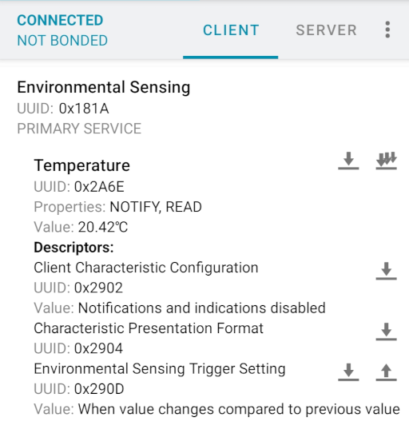

# `lib/bme68x-esp` ─ Support library for the Bluetooth Environmental Sensing Profile (ESP)

The rationale is obviously to be able to read the measurements coming from the sensors other than by watching the application log. For that:
- Bluetooth seems the most straightforward choice for transport and communication
- implementing a standardized application layer makes it possible to reuse compliant client applications

This library is a simple, mostly compliant, implementation of the Environmental Sensor role of the Bluetooth [Environmental Sensing Profile]:
- [Environmental Sensing Service] (ESS) serving the [Temperature], [Pressure] and [Humidity] ESS Characteristics
- configurable notifications with standard ES Trigger Setting descriptors
- basic connection management for OOTB use

Sample applications using this library:

- [samples/bme68x-esp]: ESS serving Temperature, Pressure and Humidity, based on [BSEC] and [BME68X Sensor API]

> [!NOTE]
>
> Please consider this ESS implementation and API experimental:
> - the current design is clearly geared toward characteristics of integer value types,
>   like temperature, pressure and humidity: supporting more complex characteristics,
>   like [Non-Methane Volatile Organic Compounds Concentration] which is planned,
>   will likely require some refactoring
> - the ESS specifications state that when they are writable, we shall allow separate control of the ES Trigger Settings
>   descriptors for each bonded client, which the current implementation has overlooked: this is another area of work in progress
> - once the above issues are cleared up, we can move on supporting up to three ES Trigger Setting descriptors
>   per characteristic per user, as permitted (but not required) by the ESS specifications
> - we currently describe measurements with Client Presentation Format descriptors rather than the ES Measurement descriptors
>   required for implementing services with more than one instance of the same ESS Characteristic: this is another limitation
>   we could try to work around
>
> This library does not depend on the BME68X Sensor API nor assume the use of BME68X devices.
> Feel free to re-use it independently of this Zephyr module.

[Environmental Sensing Profile]: https://www.bluetooth.com/specifications/specs/environmental-sensing-profile-1-0/
[Environmental Sensing Service]: https://www.bluetooth.com/specifications/specs/environmental-sensing-service-1-0/
[Temperature]: https://btprodspecificationrefs.blob.core.windows.net/gatt-specification-supplement/GATT_Specification_Supplement.pdf#3.218.3
[Pressure]: https://btprodspecificationrefs.blob.core.windows.net/gatt-specification-supplement/GATT_Specification_Supplement.pdf#3.181.3
[Humidity]: https://btprodspecificationrefs.blob.core.windows.net/gatt-specification-supplement/GATT_Specification_Supplement.pdf#3.124.3
[samples/bme68x-esp]: /samples/bme68x-esp
[BSEC]: https://www.bosch-sensortec.com/software-tools/software/bme680-software-bsec/
[BME68X Sensor API]: https://github.com/boschsensortec/BME68x_SensorAPI
[Non-Methane Volatile Organic Compounds Concentration]: https://btprodspecificationrefs.blob.core.windows.net/gatt-specification-supplement/GATT_Specification_Supplement.pdf#3.162.3

## Configuration

This library depends on the Bluetooth LE Peripheral role: see [`conf/bt_peripheral.conf`] for an example configuration file.

To enable this library:

| [`Kconfig`]  | Option                                             |
|--------------|----------------------------------------------------|
| `BME68X_ESP` | Enable Bluetooth Environmental Sensor role and ESS |

All configuration options are accessible via the Kconfig menu: `Modules → bme68x → [*] Environmental Sensing Profile`.

[`conf/bt_peripheral.conf`]: conf/bt_peripheral.conf

### Connection management

Basic connection management is configured with the options bellow:

| [`Kconfig`]               | Option                                            |
|---------------------------|---------------------------------------------------|
| `BME68X_ESP_GAP_ADV_AUTO` | Automatically resume advertising (`=y`)           |
| `BT_MAX_CONN`             | Maximum number of simultaneous connections (`=1`) |

The default behavior is thus to start advertising on reset, and to restart it when the client disconnects, allowing re-connections.

### Notifications

Notifications for each supported ESS Characteristic can be configured with an ES Trigger Setting:

- a *condition*, e.g. "When value changes compared to previous value" (default), or "While greater than the specified value"
- an *operand*: e.g. 60% when configuring notifications for Humidity

| Notifications                                      | Condition | Operand   (LE)                |
|----------------------------------------------------|-----------|-------------------------------|
| Disabled                                           | `0x00`    |                               |
| Fixed time interval between notifications          | `0x01`    | seconds (24-bit)              |
| No less that specified time between notifications  | `0x02`    | seconds (24-bit)              |
| When value changes compared to previous value      | `0x03`    |                               |
| While less than the specified value                | `0x04`    | ESS Characteristic value type |
| While less than or equal to the specified value    | `0x05`    | ESS Characteristic value type |
| While greater than the specified value             | `0x06`    | ESS Characteristic value type |
| While greater than or equal to the specified value | `0x07`    | ESS Characteristic value type |
| While equal to the specified value                 | `0x08`    | ESS Characteristic value type |
| While not equal to the specified value             | `0x09`    | ESS Characteristic value type |

These triggers:
- are pre-configured at build-time with Kconfig options, see [`conf/ess_notifications.conf`] for examples
- may be overwritten by *authorized* connected clients

Seconds are 24-bit unsigned integers.

ESS characteristic values are:
- 16-bit signed (Two's complement) integers for Temperature (degree Celsius, resolution 0.01 degree)
- 16-bit unsigned integers for Humidity (Percent, resolution 0.01%)
- 32-bit unsigned integers for Pressure (Pa, resolution 0.1 Pa)

All operands are little-endian, e.g.:

| Value               | Operand (LE) |
|---------------------|--------------|
| 20.5 degree Celsius | `0x0208`     |
| -5 degree Celsius   | `0x0cfe`     |
| 100 kPa             | `0x40420f00` |
| 63.5 %              | `0xce18`     |

> [!TIP]
>
> Fortunately, standard client applications like [nRF Connect] can interpret these descriptors
> and show a human readable representation of them.
>
> 
>
> Only re-configuring the triggers may require to manually *compute* the appropriate descriptors as described above.

[`Kconfig`]: Kconfig
[`conf/ess_notifications.conf`]: conf/ess_notifications.conf
[nRF Connect]: https://play.google.com/store/apps/details?id=no.nordicsemi.android.mcp

### Security

By default, the descriptors configuring the notifications are read-only: allowing any device within radio range to reconfigure the sensor may not be a good idea, especially if battery powered.

The options bellow authorize clients to re-configure notifications:

| [`Kconfig`]                                | Option                                       |
|--------------------------------------------|----------------------------------------------|
| `BME68X_ES_TRIGGER_SETTINGS_WRITE`         | Any connected central is authorized          |
| `BME68X_ES_TRIGGER_SETTINGS_WRITE_ENCRYPT` | Only centrals with encrypted connections     |
| `BME68X_ES_TRIGGER_SETTINGS_WRITE_AUTHEN`  | Only centrals with authenticated connections |

JustWorks pairing (`BME68X_ES_TRIGGER_SETTINGS_WRITE_ENCRYPT`, encrypted unauthenticated) should work out-of-the-box, but still means world-writable and actually provides no more *security* than `BME68X_ES_TRIGGER_SETTINGS_WRITE`.

For authenticated connections, the application must provide the usual callbacks representing the peripheral's I/O capabilities.

Options `BME68X_ES_TRIGGER_SETTINGS_WRITE_ENCRYPT` and `BME68X_ES_TRIGGER_SETTINGS_WRITE_AUHENT` rely on the Bluetooth Security Manager Protocol (`BT_SMP`).
As usual, bonding relies on the Zephyr [Settings] subsystem (`BT_SETTINGS`).

See [`conf/bt_smp.conf`].

> [!NOTE]
>
> Non-compliance with ESS specification, 3.1.2.3.1 ES Trigger Setting Descriptor and ES Configuration Descriptor Behavior:
> - bonding shall be mandatory if ES Trigger Setting descriptors are writable: for *convenience*, this library does not enforce this requirement
> - when the ES Trigger Setting descriptors are writable, the ESS shall support separate control of the descriptors for each bonded client: at the moment, all authorized clients share the same per-characteristic descriptor

[Settings]: https://docs.zephyrproject.org/latest/services/storage/settings/
[`conf/bt_smp.conf`]: conf/bt_smp.conf

## API

| API                     | Description                   |
|-------------------------|-------------------------------|
| [`bme68x_ess.h`]        | Environmental Sensing Service |
| [`bme68x_esp_gap.h`]    | Connections management        |
| [`bme68x_esp_sensor.h`] | Environmental Sensor role     |

[`bme68x_ess.h`]: include/bme68x_ess.h
[`bme68x_esp_gap.h`]: include/bme68x_esp_gap.h
[`bme68x_esp_sensor.h`]: include/bme68x_esp_sensor.h
